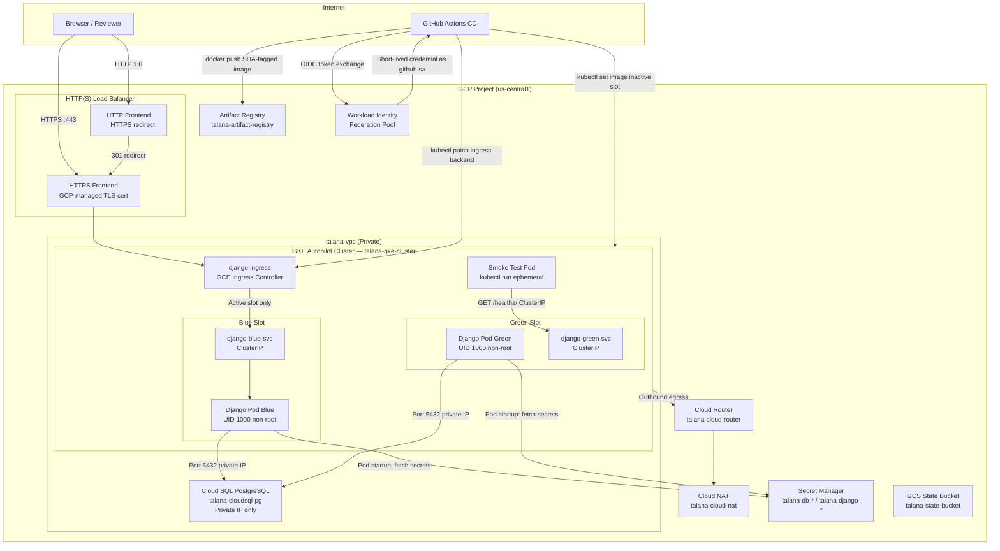

# Architecture

## Overview

The talana SRE challenge deploys a Django application on GKE Autopilot behind a GCP HTTPS Load Balancer with Blue/Green deployments managed by a GitHub Actions CD pipeline. All infrastructure is provisioned with Terraform — 5 custom modules (networking, IAM, GKE, Cloud SQL, Artifact Registry) plus a root-level static global IP resource for the load balancer. The design prioritises zero long-lived credentials, private networking, and automated zero-downtime deploys.

---

## Architecture Diagram

> **Note:** The diagram shows Blue as the active slot. In practice the active slot alternates with each deploy. The inactive slot (Green when Blue is active) receives the new image and smoke-test before Ingress is patched.

---

## Component Overview

| Component | GCP Resource | Notes |
|-----------|-------------|-------|
| Network | `talana-vpc` VPC + subnet | us-central1, private GKE nodes |
| Outbound internet | Cloud NAT `talana-cloud-nat` | GKE node outbound only; no inbound |
| Compute | GKE Autopilot `talana-gke-cluster` | No node pool management required |
| Database | Cloud SQL PostgreSQL `talana-cloudsql-pg` | db-f1-micro, private IP only |
| Registry | Artifact Registry `talana-artifact-registry` | Docker format, us-central1 |
| Secrets | Secret Manager (5 secrets) | DB host/name/user/pass + Django SECRET_KEY |
| Identity (CD) | WIF Pool + OIDC Provider | GitHub Actions → GCP, zero JSON key files |
| Identity (pods) | K8s Workload Identity + `django-ksa` | Pods → GCP, zero static credentials |
| TLS | GCP-managed SSL certificate | Auto-provisioned and auto-renewed |
| Load Balancer | GCP HTTPS LB + static global IP | HTTP→HTTPS redirect, single ingress point |
| State | GCS `talana-state-bucket` | Terraform remote state, versioned |

---

## Key Design Decisions

- **WIF over static service account keys** — GitHub Actions never holds a JSON key. An OIDC token from GitHub is exchanged for a short-lived GCP credential via the WIF pool. This eliminates the risk of long-lived key leakage.
- **Blue/Green via Ingress backend swap** — Deploying to the inactive slot first, smoke-testing it, then patching the Ingress backend means live traffic is never interrupted. Rollback is instant: re-patch Ingress back to the previous slot.
- **Secret Manager direct SDK** — Django fetches secrets at startup via `google-cloud-secret-manager`. No sidecar container, no CSI driver, no volume mounts — fewer moving parts and a smaller attack surface.
- **Init container for DB migrations** — A `db-migrate` init container runs `python manage.py migrate` before the app container starts. This ensures the database schema is always up to date before Django begins serving requests, eliminating startup failures due to unmigrated state.
- **Terraform custom modules** — Each concern (networking, IAM, GKE, Cloud SQL, Artifact Registry) is a separate reusable module under `terraform/modules/`. The root composition in `terraform/main.tf` wires them together, keeping individual modules testable and replaceable.

---

## Security Architecture

The system implements a zero-credential chain across all layers:

1. **CI/CD layer (GitHub Actions)** — Authenticates to GCP via OIDC WIF. No service account JSON keys exist. The WIF attribute condition restricts trust to the specific GitHub repository and branch.
2. **Kubernetes layer (pods)** — `django-ksa` (Kubernetes Service Account) is bound via annotation to a GCP Service Account with minimal IAM roles (`cloudsql.client`, `secretmanager.secretAccessor`). Pods receive a projected token; no static credentials are mounted.
3. **Application layer (Django)** — Secrets are fetched at pod startup from Secret Manager. No secrets appear in environment variables set in manifests, Dockerfiles, or source code.
4. **Network layer** — GKE nodes are private (no external IPs). Cloud SQL is reachable only via private IP within the VPC. All inbound traffic enters via the HTTPS Load Balancer with a GCP-managed TLS certificate.

References: NFR5 (no long-lived keys), NFR6 (private networking), NFR7 (no static pod credentials), NFR8 (no secrets in source), NFR9 (non-root containers), NFR10 (managed TLS).

---

## Data Flows

### Request Path

1. Browser → `https://talana.nacholar.com` → GCP HTTPS Load Balancer (static global IP, GCP-managed TLS)
2. Load Balancer → GKE Ingress (`django-ingress`) → active slot ClusterIP Service
3. Service → Django pod `:8000` (UID 1000, non-root)
4. Django pod (at startup) → Secret Manager → DB credentials + `SECRET_KEY` loaded into settings
5. Django → Cloud SQL private IP `:5432` (psycopg2)

### Deployment Path

1. `git push main` → GitHub Actions CD workflow triggered
2. GitHub OIDC token → WIF pool → impersonate `github-sa` → short-lived GCP credential
3. `docker build` + `docker push` → Artifact Registry (image tagged with Git SHA)
4. `detect-slot.sh` → reads current Ingress backend → determines INACTIVE slot
5. `kubectl set image deployment/<inactive>` → rollout waits for readiness
6. `smoke-test.sh` → ephemeral pod → `curl ClusterIP/healthz/` → expects HTTP 200
7. `kubectl patch ingress` → swaps backend to the newly deployed slot → zero-downtime traffic switch
